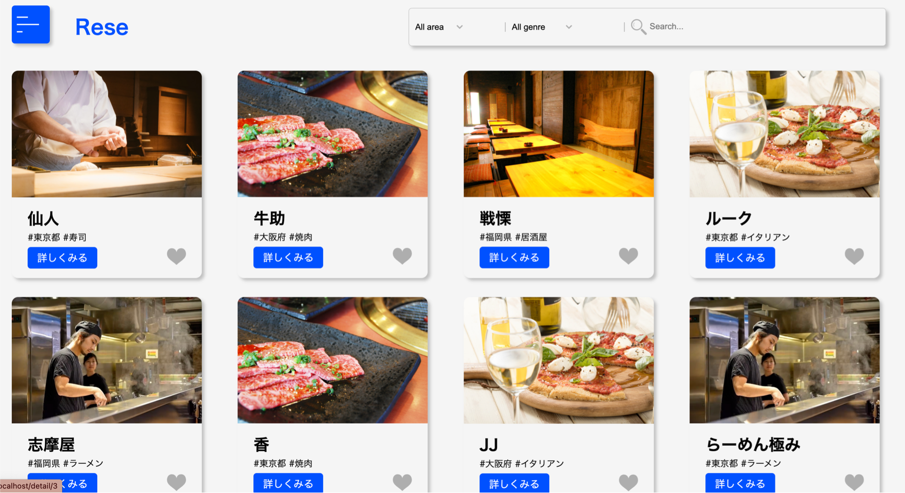
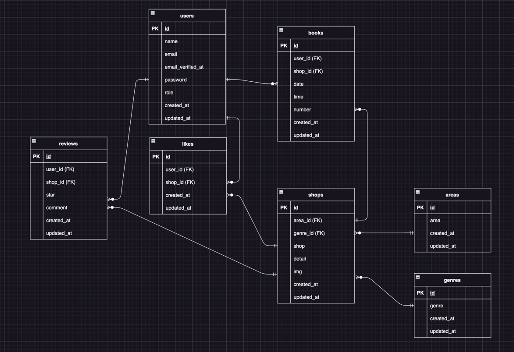

# Rese（リーズ）

ある企業のグループ会社の飲食店予約サービス

## 作成した目的

自社のサービスを持つことで、外部の飲食店予約サービスの手数料が不要になるため。

## 機能一覧

- 会員登録
- ログイン
- ログアウト
- メール認証機能
- ログイン権限機能
  - 管理者
  - 店舗代表者
  - 利用者
- ユーザー情報取得
- ユーザー飲食店お気に入り一覧取得
- 飲食店一覧取得
- 飲食店詳細取得
- 飲食店お気に入り追加・削除機能
- 飲食店予約情報追加・変更・削除機能
- 検索機能
  - エリア
  - ジャンル
  - 店名
- 飲食店評価機能
- バリデーション機能
  - 会員登録
  - ログイン
  - 予約取得・変更
  - 評価登録
  - 店舗情報登録・変更
  - 店舗代表者登録
- レスポンシブデザイン
  - ブレイクポイント768px
  - ブレイクポイント480px
- 管理者：店舗代表者登録機能
- 店舗代表者：予約確認機能
- 店舗代表者：店舗情報登録・変更機能

## 使用技術(実行環境)

- laravel8
- laravel breeze
- php
- JavaScript
- MailHog

## テーブル設計

## ER図

## 環境構築

1. リポジトリの設定(以下をクローン)

       git@github.com:YukikoTK/Takeichi_reservation_system.git

2. Dockerの設定(開発環境構築)

       $ docker-compose up -d --build

3. Laravelのパッケージのインストール

     PHPコンテナにログイン

       $ docker-compose exec php bash

     パッケージのインストール

       $ composer install

4. .envファイルの作成

       $ cp .env.example .env

5. 以下の通り.envファイルの修正

       DB_CONNECTION=mysql

       DB_HOST=mysql

       DB_PORT=3306

       DB_DATABASE=laravel_db

       DB_USERNAME=laravel_user

       DB_PASSWORD=laravel_pass

6. アプリケーションを起動するためのキーを生成

       php artisan key:generate

7. モデルのマイグレーション、データ挿入

       php artisan migrate:fresh --seed

8. mailhog導入(下記をdocker-compose.ymlに追記)

       volumes:
   
         db-volume:
   
         maildir: {}

       mail:
   
           image: mailhog/mailhog
   
           container_name: mailhog
   
           ports:
    
             - "8025:8025"
   
           environment:
   
             MH_STORAGE: maildir
   
             MH_MAILDIR_PATH: /tmp
   
           volumes:
   
             - maildir:/tmp

9. 下記コマンドを実行し、イメージの再ビルドとコンテナ起動

        $ docker-compose build

        $ docker-compose up -d

10. 下記の通り.envを修正

         MAIL_MAILER=smtp
    
         MAIL_HOST=mail
    
         MAIL_PORT=1025
    
         MAIL_USERNAME=null
    
         MAIL_PASSWORD=null
    
         MAIL_ENCRYPTION=null
    
         MAIL_FROM_ADDRESS=hello@example.com
    
         MAIL_FROM_NAME="${APP_NAME}"

11. 以下にログインし、認証メールの受信を確認

       http://localhost:8025/

12. 以下の認証済みユーザーにてログイン

- 管理者
  
     name：管理者太郎
  
     email：taro@test.com
  
     password：password

- 店舗代表者
  
     name：代表花子
  
     email：hanako@test.com
  
     password：password

- 利用者
  
     name：利用者五郎
  
     email：goro@test.com
  
     password：password

## その他

ログインの有無により、アクセスできるページが異なる。

ログイン無の場合は、以下のみアクセスが可能

 店舗一覧ページ（/）

 店舗詳細ページ（/deetail）：予約フォーム非表示

